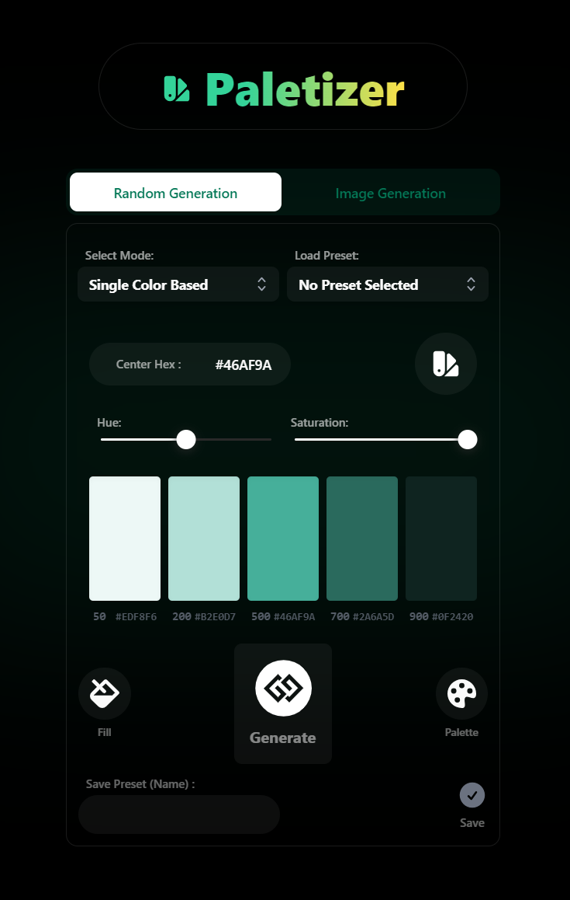

An Illustrator plugin which can generate random aesthetic color palettes in multiple modes which can integrate directly into illustrator compositions.

## Features

- Color Palette generation based on various modes:
- Single color
- Purely Random
- Based on Themes
- Image file based Palette Generation

- Fill all selected objects with a selected palette color and add it to swatches
- Bring over the entire generated palette as a group

- Ability to save and load palettes as a preset
- Other features such as hue and saturation adjustments for Single color Mode

## Plugin Walkthrough/Demonstration

https://drive.google.com/file/d/1o1a4ZljT3NRyV04s_5Ucxv5bJH_YmCC0/view?usp=drive_link

### Dev Requirements

- [Node.js](https://nodejs.org/en) 16 or later

### Compatibility

- [Adobe Illustrator CC](https://www.adobe.com/in/products/illustrator.html) version 2020 or later
- Windows

---

## Usage

- Ensure that you are using Adobe Illustrator CC 2020 or above.
- Download ZXP/UXP Installer provided by AEScripts : [https://aescripts.com/learn/zxp-installer/]
- Now install the .zxp file from dist/zxp/ , using the ZXP Installer
- Now open Illustrator and go to Window —> Extension —> Random Theme Generator v1.0

## Quick Start Guide for Developers

`git clone [repository]`

- Clone the repository

`cd [directory]`

- CD into Directory

`npm install`

- Installs all dependencies

`npm run build`

- Runs initial build
- Creates cep folder structure
- Creates symlink to extensions folder

`npm run dev`

- Runs in dev mode with HMR Hot-reloading.
- Both JS and ExtendScript folders re-build on changes
- Viewable in browser via localhost:3000/panel/
  - (e.g. http://localhost:3000/main/, http://localhost:3000/settings/, etc. (see [Panel Structure](#cep-panel-structure) to set up multiple panels)))

`npm run serve`

- Serve files after running `yarn build`
- Viewable in browser via localhost:5000/panel/
  - (e.g. http://localhost:5000/main/, http://localhost:5000/settings/, etc. (see [Panel Structure](#cep-panel-structure) to set up multiple panels)))

`npn run zxp`

- Builds and bundles your project into a zxp for publishing in the `dist/zxp` folder

`npm run zip`

- Bundles your zxp and specified assets to a zip archive in the `dist/zip` folder

---

## Config and Code Structure

Typescript or application code in `src/js/main/index.tsx`

ExtendScript code found in `src/jsx/main.ts`

---


```
